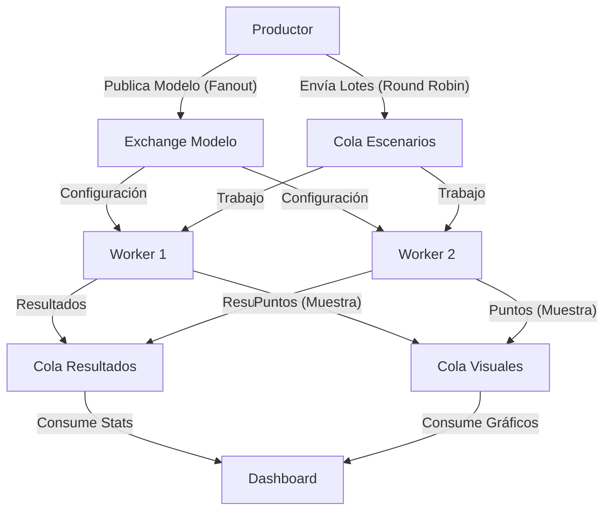

# 🧬 Simulador Montecarlo Distribuido

> Sistema distribuido para la simulación de modelos matemáticos estocásticos utilizando el patrón Productor-Consumidor y Middlewares de Mensajería.


## 📖 Descripción del Proyecto

Este proyecto implementa una arquitectura distribuida para realizar simulaciones de **Método Montecarlo** de alto rendimiento. El sistema permite definir modelos matemáticos arbitrarios (ecuaciones) y distribuciones de probabilidad mediante archivos de configuración (`JSON`), los cuales son procesados en paralelo por múltiples nodos trabajadores (Workers).

El caso de uso principal demuestra el cálculo del valor de **π (Pi)** mediante el método geométrico, visualizando la convergencia y los impactos en tiempo real.

## 🏗️ Arquitectura del Sistema

El sistema sigue una arquitectura orientada a servicios desacoplados, utilizando **RabbitMQ** como columna vertebral para la comunicación asíncrona.



### Justificación del Middleware (RabbitMQ)

Se eligió RabbitMQ en lugar de comunicación directa (Sockets/RPC) por las siguientes razones:

- **Desacoplamiento**: Los Workers no necesitan conocer la IP del Productor ni del Dashboard.
- **Persistencia y Tolerancia a Fallos**: Las colas `durable=True` garantizan que si un nodo cae, el trabajo no se pierde y es reasignado a otro nodo.
- **Balanceo de Carga Automático**: RabbitMQ distribuye los lotes de trabajo equitativamente (Fair Dispatch) entre los nodos disponibles, permitiendo escalar horizontalmente (agregar más PCs) sin detener el sistema.

## 📂 Estructura del Proyecto

```
/proyecto_montecarlo
├── docs/                   # Documentación adicional
├── modelo.json             # Definición del modelo matemático (Texto plano)
├── requirements.txt        # Dependencias del proyecto
├── src/
│   ├── common/             
│   │   ├── __init__.py
│   │   ├── broker.py       # Clase base para conexión RabbitMQ
│   │   └── config.py       # Configuración centralizada (IPs, Puertos)
│   ├── dashboard.py        # Visualizador Web en Tiempo Real
│   ├── productor.py        # Generador de escenarios y orquestador
│   └── worker.py           # Unidad de procesamiento (Escalable)
└── README.md
```

## 🚀 Instalación y Configuración

### Prerrequisitos

- Python 3.8+
- RabbitMQ Server (Instalado en al menos un equipo)

### 1. Clonar el repositorio

```bash
git clone https://github.com/TU_USUARIO/proyecto_montecarlo.git
cd proyecto_montecarlo
```

### 2. Entorno Virtual (Recomendado)

```bash
python3 -m venv venv
source venv/bin/activate  # En Linux/Mac
# .\venv\Scripts\activate # En Windows
```

### 3. Instalar Dependencias

```bash
pip install -r requirements.txt
```

### 4. Configuración Central

Edita el archivo `src/common/config.py`:

- Si corres todo en una PC: Deja `RABBITMQ_HOST = 'localhost'`
- Si es distribuido: Pon la IP del servidor RabbitMQ (ej. `'192.168.1.50'`)

## ▶️ Guía de Ejecución

El sistema debe iniciarse en el siguiente orden para asegurar la correcta declaración de colas.

### Paso 1: El Servidor (Dashboard)

Inicia la visualización para monitorear el sistema.

```bash
python src/dashboard.py
# Accede en tu navegador a: http://localhost:8050
```

### Paso 2: Los Trabajadores (Workers)

Ejecuta esto en tantas terminales o computadoras como desees.

```bash
python src/worker.py
# Verás: [*] Worker-XYZ esperando Modelo y Escenarios...
```

### Paso 3: El Orquestador (Productor)

Carga el modelo y comienza a enviar trabajo.

```bash
python src/productor.py
```

## 🧠 Explicación del Modelo (Montecarlo)

El sistema soporta la **Evaluación Dinámica de Código**. El archivo `modelo.json` define qué se va a simular.

### Ejemplo: Cálculo de PI

```json
{
  "nombre": "Simulacion de PI",
  "variables": [
    {"nombre": "x", "distribucion": "uniform", "params": [-1, 1]},
    {"nombre": "y", "distribucion": "uniform", "params": [-1, 1]}
  ],
  "funcion_evaluacion": "x**2 + y**2 <= 1"
}
```

**Cómo funciona:**

- **Distribución Uniforme**: Genera puntos aleatorios llenando todo el espacio cuadrado.
- **Evaluación**: El worker usa `eval()` para determinar si el punto cayó dentro del círculo unitario.
- **Resultado**: La proporción de puntos dentro vs. total aproxima el valor de π.

> **Nota**: El sistema soporta distribuciones `normal`, `exponential`, `beta`, etc. Cambiar la distribución afectará el resultado geométrico, útil para demostrar el comportamiento estocástico.

## 📚 Información del Curso

**Asignatura**: Programación Distribuida Aplicada  
**Periodo**: Noviembre 2025


## 📧 Contacto

axurmen214@gmail.com