# 🧬 Simulador Montecarlo Distribuido

> Sistema distribuido para la simulación de modelos matemáticos estocásticos utilizando el patrón Productor-Consumidor y Middlewares de Mensajería.


## 📖 Descripción del Proyecto

Este proyecto implementa una arquitectura distribuida para realizar simulaciones de **Método Montecarlo** de alto rendimiento. El sistema permite definir modelos matemáticos arbitrarios (ecuaciones) y distribuciones de probabilidad mediante archivos de configuración (`JSON`), los cuales son procesados en paralelo por múltiples nodos trabajadores (Workers).

El caso de uso principal demuestra el cálculo del valor de **π (Pi)** mediante el método geométrico, visualizando la convergencia y los impactos en tiempo real.

## 🏗️ Arquitectura del Sistema

El sistema sigue una arquitectura orientada a servicios desacoplados, utilizando **RabbitMQ** como columna vertebral para la comunicación asíncrona.

```mermaid
graph TD;
    P[Productor] -- "Publica Modelo (Fanout)" --> EX[Exchange Modelo];
    P -- "Envía Lotes (Round Robin)" --> Q1[Cola Escenarios];
    
    EX -- "Configuración" --> W1[Worker 1];
    EX -- "Configuración" --> W2[Worker 2];
    
    Q1 -- "Trabajo" --> W1;
    Q1 -- "Trabajo" --> W2;
    
    W1 -- "Resultados" --> Q2[Cola Resultados];
    W2 -- "Resultados" --> Q2;
    
    W1 -- "Puntos (Muestra)" --> Q3[Cola Visuales];
    W2 -- "Puntos (Muestra)" --> Q3;
    
    Q2 -- "Consume Stats" --> D[Dashboard];
    Q3 -- "Consume Gráficos" --> D;
```



### Justificación del Middleware (RabbitMQ)

Se eligió RabbitMQ en lugar de comunicación directa (Sockets/RPC) por las siguientes razones:

- **Desacoplamiento**: Los Workers no necesitan conocer la IP del Productor ni del Dashboard.
- **Persistencia y Tolerancia a Fallos**: Las colas `durable=True` garantizan que si un nodo cae, el trabajo no se pierde y es reasignado a otro nodo.
- **Balanceo de Carga Automático**: RabbitMQ distribuye los lotes de trabajo equitativamente (Fair Dispatch) entre los nodos disponibles, permitiendo escalar horizontalmente (agregar más PCs) sin detener el sistema.

## 📂 Estructura del Proyecto

```
/proyecto_montecarlo
├── docs/                   # Documentación adicional
├── modelo.json             # Definición del modelo matemático (Texto plano)
├── requirements.txt        # Dependencias del proyecto
├── src/
│   ├── common/             
│   │   ├── __init__.py
│   │   ├── broker.py       # Clase base para conexión RabbitMQ
│   │   └── config.py       # Configuración centralizada (IPs, Puertos)
│   ├── dashboard.py        # Visualizador Web en Tiempo Real
│   ├── productor.py        # Generador de escenarios y orquestador
│   └── worker.py           # Unidad de procesamiento (Escalable)
└── README.md
```

## 🚀 Instalación y Configuración

### Prerrequisitos

- Python 3.8+
- RabbitMQ Server (Instalado en al menos un equipo)

### 1. Clonar el repositorio

```bash
git clone https://github.com/TU_USUARIO/proyecto_montecarlo.git
cd proyecto_montecarlo
```

### 2. Entorno Virtual (Recomendado)

```bash
python3 -m venv venv
source venv/bin/activate  # En Linux/Mac
# .\venv\Scripts\activate # En Windows
```

### 3. Instalar Dependencias

```bash
pip install -r requirements.txt
```

### 4. Configuración Central

Edita el archivo `src/common/config.py`:

- Si corres todo en una PC: Deja `RABBITMQ_HOST = 'localhost'`
- Si es distribuido: Pon la IP del servidor RabbitMQ (ej. `'192.168.1.50'`)

## ▶️ Guía de Ejecución

El sistema debe iniciarse en el siguiente orden para asegurar la correcta declaración de colas.

### Paso 1: El Servidor (Dashboard)

Inicia la visualización para monitorear el sistema.

```bash
python src/dashboard.py
# Accede en tu navegador a: http://localhost:8050
```

### Paso 2: Los Trabajadores (Workers)

Ejecuta esto en tantas terminales o computadoras como desees.

```bash
python src/worker.py
# Verás: [*] Worker-XYZ esperando Modelo y Escenarios...
```

### Paso 3: El Orquestador (Productor)

Carga el modelo y comienza a enviar trabajo.

```bash
python src/productor.py
```

## 🧠 Explicación del Modelo (Montecarlo)

El sistema soporta la **Evaluación Dinámica de Código**. El archivo `modelo.json` define qué se va a simular.

### Ejemplo: Cálculo de PI

```json
{
  "nombre": "Simulacion de PI",
  "variables": [
    {"nombre": "x", "distribucion": "uniform", "params": [-1, 1]},
    {"nombre": "y", "distribucion": "uniform", "params": [-1, 1]}
  ],
  "funcion_evaluacion": "x**2 + y**2 <= 1"
}
```

**Cómo funciona:**

- **Distribución Uniforme**: Genera puntos aleatorios llenando todo el espacio cuadrado.
- **Evaluación**: El worker usa `eval()` para determinar si el punto cayó dentro del círculo unitario.
- **Resultado**: La proporción de puntos dentro vs. total aproxima el valor de π.

> **Nota**: El sistema soporta distribuciones `normal`, `exponential`, `beta`, etc. Cambiar la distribución afectará el resultado geométrico, útil para demostrar el comportamiento estocástico.

## 🎯 Guía Maestra de Configuración

Aquí encontrarás diferentes configuraciones para tu archivo `modelo.json`. Cada una produce un comportamiento visual y matemático diferente.

> **Cómo usar**: Simplemente copia el JSON que desees, pégalo en tu archivo `modelo.json`, guárdalo y ejecuta `python src/productor.py`.

### 1. 🎲 Distribución Uniforme (Cálculo de Pi)

Esta es la configuración estándar. Los "dardos" caen en cualquier lugar del cuadrado con la misma probabilidad.

- **Uso**: Para calcular áreas reales y demostrar el funcionamiento correcto
- **Parámetros**: `[minimo, maximo]`

```json
{
  "nombre": "Calculo de PI (Uniforme)",
  "variables": [
    {
      "nombre": "x",
      "distribucion": "uniform",
      "params": [-1, 1]
    },
    {
      "nombre": "y",
      "distribucion": "uniform",
      "params": [-1, 1]
    }
  ],
  "funcion_evaluacion": "x**2 + y**2 <= 1"
}
```

**📊 En el Dashboard**: Verás un círculo verde completo y perfecto ("Luna llena"). El valor de π será ≈ 3.1416.

---

### 2. 🎯 Distribución Normal (Gaussiana)

Aquí simulamos que el lanzador apunta al centro. La mayoría de los dardos caerán cerca de (0,0).

- **Uso**: Para demostrar distribuciones no uniformes (más realista en biología o física)
- **Parámetros**: `[media, desviacion_estandar]`
  - **Media (0)**: El centro del tiro
  - **Desviación (0.3)**: Qué tanto se dispersan (mientras más bajo, más apretados)

```json
{
  "nombre": "Tiro al Blanco (Gaussiana)",
  "variables": [
    {
      "nombre": "x",
      "distribucion": "normal",
      "params": [0, 0.3]
    },
    {
      "nombre": "y",
      "distribucion": "normal",
      "params": [0, 0.3]
    }
  ],
  "funcion_evaluacion": "x**2 + y**2 <= 1"
}
```

**📊 En el Dashboard**: Verás una "mancha" brillante y densa en el centro que se desvanece hacia afuera. Las esquinas del cuadrado estarán vacías (puntos rojos escasos).

---

### 3. 📉  Distribución Exponencial

Los valores se agrupan cerca de cero y decaen rápidamente hacia los positivos.

- **Uso**: Simular tiempos de espera o decaimiento radiactivo
- **Parámetros**: `[escala]` (usualmente 1.0)
- **⚠️ Nota**: Esta distribución genera solo valores positivos, así que verás solo el cuadrante superior derecho

```json
{
  "nombre": "Decaimiento Exponencial",
  "variables": [
    {
      "nombre": "x",
      "distribucion": "exponential",
      "params": [0.5]
    },
    {
      "nombre": "y",
      "distribucion": "exponential",
      "params": [0.5]
    }
  ],
  "funcion_evaluacion": "x**2 + y**2 <= 1"
}
```

**📊 En el Dashboard**: Verás una concentración muy fuerte en la esquina inferior izquierda (0,0) y puntos dispersos hacia arriba y la derecha.

---

### 4. 🔄 La Distribución Beta

Es una distribución muy flexible acotada entre 0 y 1. Se usa mucho en probabilidad bayesiana.

- **Uso**: Modelar probabilidades o proporciones
- **Parámetros**: `[alpha, beta]`
  - Si α=β=0.5: Forma de "U" (muchos en las orillas, pocos en el centro)
  - Si α=β=2: Forma de campana (parecida a la normal)

```json
{
  "nombre": "Distribucion Beta (Valle)",
  "variables": [
    {
      "nombre": "x",
      "distribucion": "beta",
      "params": [0.5, 0.5]
    },
    {
      "nombre": "y",
      "distribucion": "beta",
      "params": [0.5, 0.5]
    }
  ],
  "funcion_evaluacion": "x**2 + y**2 <= 1"
}
```

**📊 En el Dashboard**: Este es muy interesante. Verás muchos puntos pegados a las líneas del 0 y del 1, pero el centro estará más vacío. Solo ocupará el cuadrante superior derecho (0 a 1).

## 📚 Información del Curso

**Asignatura**: Programación Distribuida Aplicada  
**Periodo**: Noviembre 2025

## 📧 Contacto

axurmen214@gmail.com